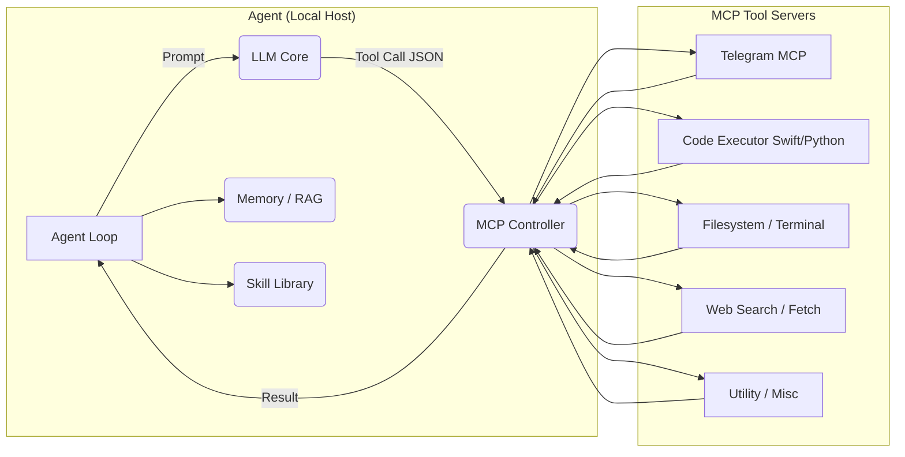

# 🧠 **Neuronaut** – Autonomous Local‑First LLM Agent Platform

**Self‑improving agents · On‑device & edge AI · Secure tool integration · Swift-powered modules**

---

            

---

## 🚀 Quick Pitch

**Neuronaut** is a lifelong-learning, **autonomous agent** that runs locally and teaches itself to accomplish multi-step goals by:

1. **Planning** – using a local LLM (Mistral, Qwen, Mixtral)
2. **Acting** – issuing MCP tool calls (filesystem, web, CLI, Telegram)
3. **Learning** – storing successful routines as reusable **skills**
4. **Adapting** – retrieving past logs and skills for new tasks

> Inspired by Voyager, powered by Swift + Python, tested on Raspberry Pi and Apple Silicon.

---

## 🧩 System Architecture



---

## 🏗️ Component Overview

| Layer              | Component                    | Notes                                      |
| ------------------ | ---------------------------- | ------------------------------------------ |
| **LLM Inference**  | `llama.cpp` + GGUF + Paddler | Mistral Small 3, Mixtral, Qwen 3 supported |
|                    | Petals                       | Optional distributed inference             |
| **Planning**       | LangChain / Python / Swift   | Generates step-by-step goals               |
| **Tool Execution** | MCP (Model Context Protocol) | Secure JSON tool interface                 |
| **Memory / RAG**   | Chroma / Qdrant              | Stores logs, task history, embeddings      |
| **Skill Library**  | JSON/SQLite + Embeddings     | Stores reusable code/actions               |
| **Execution**      | Swift + Docker + Shell       | Secure wrappers for CLI/Swift tools        |

---

## 🧠 Loop Lifecycle

1. Receive high-level goal
2. Retrieve memory and skills via embedding search
3. Plan subgoals with local LLM
4. Emit structured tool calls (e.g. run code, search web)
5. Observe result/output
6. Critic (optional) evaluates result
7. Retry or confirm
8. If successful: generate docstring + function → add to Skill Library

---

## 🧪 Supported Tools (via MCP)

| Tool Server        | Purpose                                              |
| ------------------ | ---------------------------------------------------- |
| **Filesystem MCP** | Read/write/append/edit files (controlled path)       |
| **Terminal MCP**   | Run bash commands (allowlisted only)                 |
| **Code Executor**  | Compile/run Swift & Python via sandbox or Docker     |
| **Telegram MCP**   | Chat integration for gamebots or tasks               |
| **Web Fetcher**    | HTTP requests for data fetching or queries           |
| **Memory MCP**     | Store and retrieve raw info (key-value or doc store) |

---

## 🧰 Swift Integration

* MCP tools written in Swift for performance and control
* Swift Package support: agent can build, run, and debug Swift code from README
* Optional Swift CLI version of the agent loop (in progress)
* Uses native Swift wrappers for:

  * bash command sandbox
  * file edits
  * code compilation (xcodebuild / swift build)

---

## 🧠 Skill Library Format

```json
{
  "name": "create_swift_package",
  "description": "Create and compile a Swift executable from spec",
  "code": "swift package init --type executable...",
  "tools_used": ["Filesystem", "Code Executor"],
  "embedding": [0.124, -0.534, ...],
  "success_rate": 0.92
}
```

Indexed via vector DB for retrieval. Agent can call old skills if task is similar.

---

## 🛡️ Safety & Control

* MCP tool call quotas and rate limits
* Tool input sanitization (no `rm`, no internet writes)
* Timeout and watchdogs for infinite loops
* Session resumption & audit logging

---

## 📈 Development Roadmap

* [ ] **LLM Setup** – install llama.cpp, load Mistral model
* [ ] **Multi-host Scaling** – set up Paddler with Macs + Pi
* [ ] **MCP Tool Servers** – filesystem, terminal, code, web, memory
* [ ] **Agent Loop MVP** – planning + tool call + retry loop
* [ ] **Skill Library v1** – indexed by embedding + metadata
* [ ] **Memory Persistence** – log, skill, context snapshots
* [ ] **Self-Verification** – optional critic LLM step
* [ ] **GUI Monitor / TUI log viewer**
* [ ] **Auto-curriculum** – escalate task difficulty based on past success
* [ ] **Fine-tuning / LoRA support** – optional later phase

---

## 📚 Resources Used

* [llama.cpp](https://github.com/ggerganov/llama.cpp)
* [Qwen-Agent](https://github.com/QwenLM/Qwen-Agent)
* [modelcontextprotocol](https://github.com/modelcontextprotocol/servers)
* [ChromaDB](https://github.com/chroma-core/chroma)
* [Paddler](https://github.com/distantmagic/paddler)
* [Voyager](https://voyager.minedojo.org)
* [Anthropic Claude / MCP](https://docs.anthropic.com)

All components are Apache 2.0 or MIT licensed.

---

## ✅ Summary

**Neuronaut** is a secure, autonomous agent framework with real tool access and self-adaptive learning. It uses Swift where performance and control matter, with Python-based glue and memory orchestration. Inspired by Voyager and Claude, but 100% self-hosted and customizable.

Supports Swift toolchains, full local LLMs, replayable skills, embedded memory, and tool use over MCP. Learns and grows task by task.
