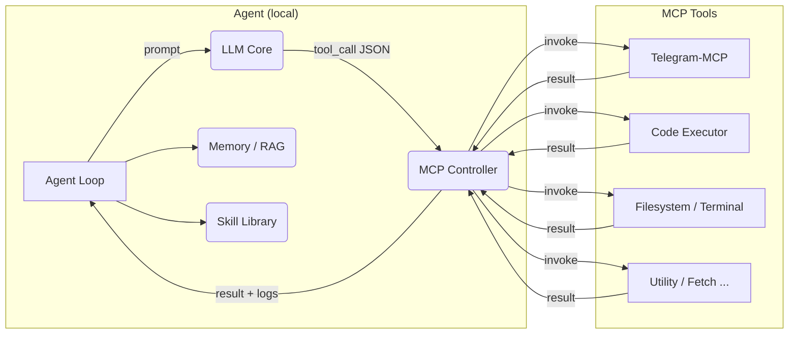

# 🧠 **NeuroNaut** – Autonomous Local‑First LLM Agent Platform

**Self‑improving agents · On‑device & edge AI · Secure tool integration**

---

              

---

**NeuroNaut** is a fully self‑hosted, lifelong‑learning agent inspired by *Voyager*.  It runs entirely on your own Apple‑Silicon or Intel Macs, explores new environments, discovers reusable **skills**, and executes real tools through the **Model Context Protocol (MCP)**.

*No cloud APIs.  No data leaves your LAN.  Just pure, private AI power.*

---

## 🚀 Quick Pitch

NeuroNaut loops forever:

1. **Perceive** – Read structured state from MCP tools (e.g. Telegram game chat, filesystem, compiler logs).
2. **Plan & Think** – Use a local LLM (default **Mistral Small 3**, fallback **Mixtral 8×22 B** / **Qwen 3‑A3B**) with RAG memory.
3. **Act** – Emit JSON function calls.  The controller invokes Telegram buttons, compiles Swift, runs shell commands…
4. **Learn** – If the action succeeds, summarise it into a new **skill**.  Store code + docstring + embedding → Skill Library.
5. **Repeat** – Automatic curriculum keeps pushing to harder goals (beat RPG boss, ship Swift package, etc.).

Over time NeuroNaut builds a personal toolbox of code routines and action macros – ready to solve ever larger tasks.

---

## 🏗️ System Architecture

* **LLM Core** – llama.cpp‑backed local model pool (Mistral Small 3 default). Load‑balanced via **Paddler** or **Petals**.
* **Memory /RAG** – Vector DB (Chroma/Qdrant) + optional Knowledge‑Graph MCP.
* **Skill Library** – Proven code snippets/functions indexed by embeddings.
* **MCP Tools** – Isolated services (Telegram, code‑sandbox, filesystem, etc.).
* **Agent Loop** – Python `asyncio` controller orchestrating LLM ⇄ Tools ⇄ Memory.

---

## 🛠️ Tech Stack

| Layer | Component | Notes |
|-------|-----------|-------|
| **LLM Inference** | **llama.cpp** (Apple Silicon) | 4‑bit GGUF models; GPU/Metal acceleration |
|  | **Paddler / Petals** | Distribute queries across multiple Macs |
| **Default Model** | **Mistral Small 3 (24 B)** | 150 tok/s, native function‑calling, 128 K ctx, vision variant |
| **Fallbacks** | Mixtral 8×22 B · Qwen 3‑30B‑A3B | Higher reasoning / longer context |
| **Orchestration** | LangChain / LlamaIndex | Pure‑local pipelines |
| **Vector DB** | Chroma / Qdrant | Stores memories & skill metadata |
| **MCP Servers** | Telegram‑MCP · Code‑Executor · Filesystem · iTerm | Secure, sandboxed tool wrappers |
| **Languages** | Swift · Python · Bash | Swift for exec tools, Python for orchestration |
| **Ops** | Docker · Git · systemd | Containerised services, auto‑restart |

---

### 🔍 Language‑Model Selection Matrix

| # | Requirement | Best Fit | Why |
|---|-------------|---------|-----|
| 1 | Tool/function JSON | **Mistral Small 3** | OpenAI‑style schema, zero adapter code |
| 2 | Fast inference (< 32 GB) | **Mistral Small 3** | 11 GB Q4\_K\_M, 150 tok/s |
| 3 | Deep reasoning | Mixtral 8×22 B | +10 % higher coding benchmarks |
| 4 | > 65 K context | Qwen 3‑30B‑A3B | 131 K tokens |
| 5 | Native vision | Mistral Small 3 Vision | Built‑in SigLIP encoder |

Switch engines via `LLM_BACKEND` env var.  GGUF models live in `./models`.

---

## 📚 Open‑Source Building Blocks

* **llama.cpp** – local LLM runtime (Apple Metal / CPU)
* **Paddler** – Rust balancer for multiple llama.cpp servers
* **Telethon‑MCP** – Telegram API wrapper as MCP tool
* **modelcontextprotocol/servers** – reference *code‑executor*, *filesystem*, *memory* tools
* **Chroma / Qdrant** – vector stores for RAG & skills
* **LangChain / LlamaIndex** – orchestration layer
* **Docker** – containerise MCP servers, DB, dashboards

All under permissive licences (Apache 2.0, MIT).  100 % self‑hosted.

---

## 🗺️ Development Roadmap & Checklist

- [ ] **LLM Inference Setup** – build & test llama.cpp (LLaMA‑2 7 B)
- [ ] **Cluster Balancing** – deploy Paddler / Petals pool
- [ ] **Telegram‑MCP** – connect bot, test `press_button`
- [ ] **Code‑Executor MCP** – sandboxed Swift/Python compile‑run
- [ ] **Filesystem MCP** – read/write code, logs
- [ ] **Vector DB** – install Chroma, integrate embeddings
- [ ] **Skill Library v0** – JSON/SQLite schema, embedding index
- [ ] **Agent Loop MVP** – prompt → JSON tool → result loop
- [ ] **RPG Autoplay PoC** – reach level 2 automatically
- [ ] **Self‑Verification & Rewards** – goal checker helper
- [ ] **Swift‑Package Builder** – generate, compile, iterate
- [ ] **Memory Replay & Long‑term RAG**
- [ ] **Skill Consolidation** – summarise & store reusable skills
- [ ] **Safety Rails** – timeouts, retry, sandbox quotas
- [ ] **Progress File** – agent marks tasks complete for next session

> **Progress is persistent** – the agent resumes where the checklist stops.

---

## 📈 How It Learns (Quick Example)

1. **Goal** → “Defeat Forest Goblin Boss.”  
2. LLM plans → calls `press_button{"label":"Hunt"}`  
3. Telegram‑MCP presses *Hunt*; returns fight log.  
4. LLM interprets HP & damage, decides to heal → `press_button{"label":"Use Potion"}`.  
5. After victory, controller prompts: *"Write a reusable skill."*  
6. LLM emits Python function `def fight_forest_boss(): ...` + docstring.  
7. Skill stored in library with embedding.  Next time, similar goal triggers retrieval & reuse.
